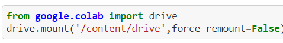

# Deep Movie Genre Prediction

## Description:
Model that predicts movie genres using movies posters and plots

##  Datasets:
   * Movie plots from site "https://www.kaggle.com/dadajonjurakuziev/movieposter"
   *  movie_plots_by_poster_revised.csv
   *  duplicate_free_41K.csv

## Instructions:
We have three notebooks, each containing a model:
* cnn_movie_genre_classifier.ipynb, which contains the cnn model, using posters only 
* encoder_movie_genre_classifier.ipynb, which contains the encoder model, using plots only
* combined_models_movie_genre_classifier.ipynb, which combines the two above models into one final model. This models uses plots and posters

### Setup:

#### `Setup using google account:`
   
   1. Open a directory in your google drive "My Drive" directory titled "FinalProject". Place in it the "img_41k.zip" and "movie_plots_by_poster_revised" files.
   2. Run each of the files "genre_prediction_cnn", "genre_prediction_encoder", and "genre_prediction_combined_models" in google colab.
   * Note: You will probably need to user colab pro

#### `Setup on your computer:`

1. Download the respository. 
2. Remove the following code from each of the notebook files:
   
   
3. Remove every instance of an exclamation point ("!") when it appears at the start of a line of code.
* Note: You will need a GPU or TPU and at least 25 GB of available RAM on your device
  

